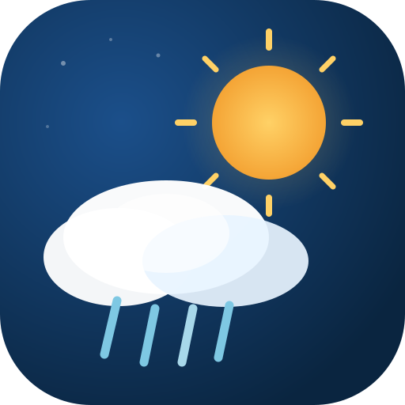

<div align="center">



# Weather View

### Your Sky. Your Way.

A beautiful, real-time weather application built with pure vanilla JavaScript, HTML, and CSS. No frameworks. No dependencies. Just clean code and stunning visuals.

[](https://jagratsati45.github.io/Weather-App/)
[](https://github.com/jagratsati45/Weather-App)
[](https://www.linkedin.com/in/jagratsati045/)

---

</div>

## ✨ Features

| Feature | Description |
|---------|-------------|
| 🌡️ **Real-Time Weather** | Current temperature, humidity, wind speed, visibility |
| 📊 **Air Quality Index** | PM2.5, CO, O₃ readings with color-coded badges |
| ⏰ **24-Hour Forecast** | Next 8 time slots with condition emojis |
| 📅 **5-Day Forecast** | Daily high/low temperatures |
| 🌅 **Sunrise/Sunset Arc** | Animated SVG sun position tracker |
| 👕 **Smart Tips** | Clothing and activity suggestions based on weather |
| 🎨 **Dynamic Themes** | Background changes based on weather conditions |
| ✨ **Animated Particles** | Canvas-based rain, snow, stars, lightning effects |
| 🌙 **Dark/Light Mode** | Toggle via settings panel |
| 📍 **Geolocation** | One-tap current location weather |
| 🔍 **City Search** | Auto-complete from search history |
| ⭐ **Favorites** | Star cities for quick access |
| 🕐 **Search History** | Last 5 searches with clear option |
| 📱 **Fully Responsive** | Mobile, tablet, and desktop optimized |
| ⚡ **Session Caching** | 10-minute cache reduces API calls |
| 🔄 **Pull to Refresh** | Touch gesture on mobile devices |

---

## 🎬 Weather Themes

| Condition | Background | Particle Effect |
|-----------|-----------|-----------------|
| ☀️ Sunny | Warm amber gradient | Golden floating particles |
| 🌙 Night | Deep navy sky | Twinkling stars + shooting stars |
| 🌧️ Rainy | Blue-gray tones | Continuous rain drops |
| ❄️ Snowy | Ice-blue gradient | Drifting snowflakes |
| ⛈️ Stormy | Dark purple | Heavy rain + lightning flashes |
| ☁️ Cloudy | Slate gray | Slow-drifting cloud shapes |

---

## 🛠️ Tech Stack

| Technology | Purpose |
|-----------|---------|
| HTML5 | Semantic structure |
| CSS3 | Glassmorphism, animations, responsive grid |
| Vanilla JS | ES Modules, Canvas API, Geolocation API |
| OpenWeatherMap | Weather data, forecasts, air pollution |
| Tabler Icons | Professional UI icons |
| Canvas API | 60fps particle animations |

---

## 🚀 Quick Start

```bash
# Clone the repository
git clone https://github.com/jagratsati45/Weather-App.git

# Navigate to the project
cd Weather-App

# Open in browser (use any local server)
npx serve .
# or use VS Code Live Server
```

### API Key Setup

1. Get a free API key from [OpenWeatherMap](https://home.openweathermap.org/api_keys)
2. Open `config.js`
3. Replace the API key value with yours

```javascript
const API_KEY = 'your_api_key_here';
```

---

## 📁 Project Structure

```
Weather-App/
├── index.html              # Main HTML structure
├── style.css               # All styles (responsive + themes)
├── app.js                  # Application logic (ES Module)
├── config.js               # API configuration
├── manifest.webmanifest    # PWA manifest
├── .gitignore              # Git ignore rules
├── README.md               # This file
└── assets/
    ├── weather-view-icon.svg       # App icon
    ├── weather-view-favicon.svg    # Browser tab icon
    ├── weather-view-banner.svg     # Wide banner logo
    └── weather-view-og-image.svg   # Social share image
```

---

## 📱 Responsive Design

| Device | Layout |
|--------|--------|
| 📱 Mobile (<768px) | Single column, compact navbar |
| 📟 Tablet (768-1099px) | 2-column grid, full-width forecast |
| 💻 Desktop (1100px+) | Wide 2-column with sidebar widgets |

---

## 🎯 Key Highlights

- **Zero Dependencies** — No npm, no frameworks, no build step
- **60fps Animations** — Canvas-based weather particles
- **Accessible** — ARIA labels, keyboard navigation, reduced motion support
- **Offline Aware** — Detects connectivity, shows cached data
- **Smart Caching** — SessionStorage with 10-minute TTL
- **Input Sanitization** — XSS-safe city name handling
- **Debounced Search** — 400ms delay prevents API spam

---

## 👨‍💻 Author

<div align="center">

**Jagrat Sati**

[](https://github.com/jagratsati45)
[](https://www.linkedin.com/in/jagratsati045/)

</div>

---

## 📄 License

This project is open source and available under the [MIT License](LICENSE).

---

<div align="center">

**Weather View** — Built with ❤️ by Jagrat Sati

*Your Sky. Your Way.*

</div>
